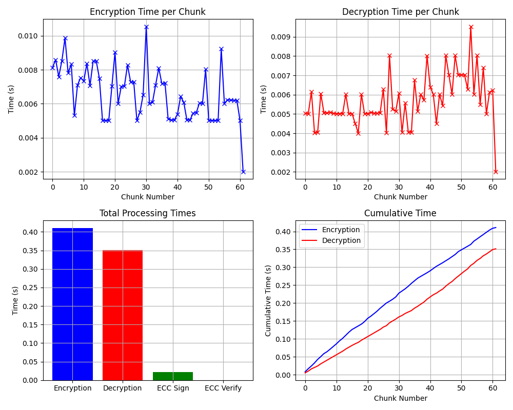

# Next-Gen-Multikey-Encryption-A-Hybrid-Model-for-Video-Security
This project implements a hybrid cryptographic system for secure video file encryption using multiple AES keys in parallel. It also integrates Elliptic Curve Cryptography (ECC) for digital signature generation and verification to ensure authenticity and integrity. 
Features:
Parallel encryption/decryption using ThreadPoolExecutor

Chunk-wise AES encryption with multiple keys

ECC-based signature and verification

Graphs for performance metrics (time per chunk, cumulative time, total time)

Technologies Used:
Python

PyCryptodome

Cryptography library (ECC)

Matplotlib for visualizations

##  Results

The graph below shows:
- Time per chunk for encryption and decryption
- Cumulative processing time
- Total processing time comparison

